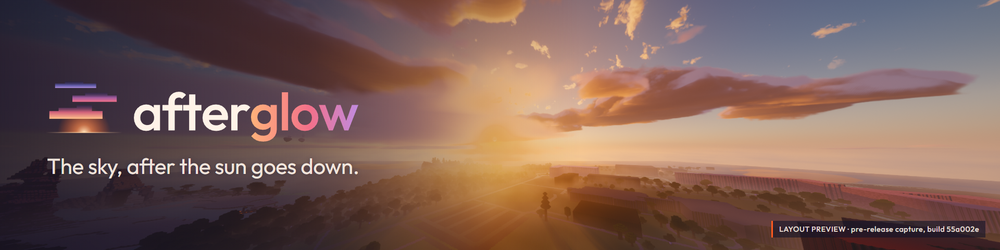

# Afterglow

**[Download the preview bundle](https://github.com/trevor050/mc-shader-bench/releases/download/preview-2026-09-26.2/Afterglow-preview-2026-09-26.2-bundle.zip) · [Shader only](https://github.com/trevor050/mc-shader-bench/releases/download/preview-2026-09-26.2/Afterglow-preview-2026-09-26.2.zip) · [Gallery](docs/afterglow/gallery/GALLERY.md) · [Installation](docs/afterglow/INSTALL.md)**

> **Development preview.** This is a first look, not version 1.0. Preview `2026-09-26.2` adds the End ambience companion and an optional GUI compatibility experiment; its shader payload is unchanged from `7965748`. Screenshots below are real captures from earlier build `55a002e`. Final visual polish, performance targets and broader compatibility testing remain unfinished. Potato clouds remain a known rough edge.

A sky-first shader pack for Iris. Volumetric clouds you can fly through, sunsets that change from day to day, aurora on cold nights, a Milky Way that emerges as twilight deepens, and block light that takes the color of its source.

**Minecraft 26.2 · Iris 1.11.4 · Distant Horizons supported**

| | |
| --- | --- |
|  |  |
|  |  |

Screenshots are real in-game captures, cropped and resized only. They were taken in a Terralith + Tectonic world with Distant Horizons installed. [More in the gallery](docs/afterglow/gallery/GALLERY.md).

## Features

**Sky and clouds.** Volumetric clouds at several heights that you can enter and fly above, with shadows on the ground and reflections in water. Sunsets vary: most are restrained, and now and then the clouds catch a richer afterglow. Biome climate gently changes haze and cloud cover.

**Night.** Curtain aurora, with four choices for when it appears (snowy biomes, snowy biomes at full moon, a random 10% of nights, or every night). A Milky Way that fades in after sunset. Moonlit cloud edges and fireflies.

**Light and weather.** Colored block light from torches, soul torches, lava and other sources, including held items. Rain with ripples and puddles, storm darkening and landscape lightning. Water with reflections, caustics and shore foam.

**Other dimensions.** Smoke and heat haze around Nether lava. The optional End companion adds an alien storm with wind, rumble, choir, synchronized thunder and gusts that push the player.

## Install

1. Install Iris and Sodium for Minecraft 26.2.
2. [Download the shader ZIP](https://github.com/trevor050/mc-shader-bench/releases/download/preview-2026-09-26.2/Afterglow-preview-2026-09-26.2.zip).
3. Put `Afterglow-preview-2026-09-26.2.zip` in your `shaderpacks` folder without unzipping it.
4. Select it in **Options → Video Settings → Shader Packs**.

See [the installation guide](docs/afterglow/INSTALL.md) for launcher-specific steps, Distant Horizons and troubleshooting.

The [bundle](https://github.com/trevor050/mc-shader-bench/releases/tag/preview-2026-09-26.2) includes two independent, optional Fabric client mods in `optional-mods/`. Move either JAR into the instance's `mods` folder and install Fabric API for 26.2. Both require Java 25 and a restart. The shader works without them.

**Chat and GUI compatibility experiment.** The optional GUI add-on reduces queued GPU frames while a screen is open. It can cost some GUI FPS, leaves shader quality unchanged, and supports `/afterglowfix off` for immediate comparison. The severe typing-related frame drop reported on an RTX 2060 Super has **not** been reproduced or confirmed fixed. Local input tests, limits and the source investigation are [documented here](docs/gui-stall-diagnosis.md). Keep the shader ZIP's exact filename for the add-on's activation check.

## Requirements and testing

- OpenGL 4.3 (compute shaders) is required, so macOS is not supported.
- **Tested:** Windows 11, NVIDIA RTX 4070, Iris 1.11.4, Sodium 0.9.2, Distant Horizons 3.3.2.
- **Not yet tested:** AMD and Intel GPUs, Linux, switchable-graphics laptops, other versions, and other rendering mods.

## Profiles

Ultra (default), High, Medium, Low and Potato, chosen in **Shader Pack Settings**. Each step lowers shadow, reflection, cloud and volumetric-light budgets. Potato is a separate lightweight path: it keeps a simplified sky and clouds and uses Minecraft's own lighting. Artistic settings are independent of the profile.

**Earlier development measurements, not a benchmark of every scene or a final performance claim.** Numbers from a release candidate, on one stationary daytime landscape (RTX 4070, 2560×1351, render distance 32, Distant Horizons radius 64). These are medians, not a whole-game average:

| Profile | GPU busy | Frame time |
| --- | ---: | ---: |
| Ultra | 17.5 ms | 20.6 ms |
| High | 15.4 ms | 18.3 ms |
| Medium | 13.0 ms | 15.4 ms |
| Low | 9.5 ms | 12.0 ms |
| Potato | 4.3 ms | 5.6 ms |

Moving through the world, loading chunks and bad weather cost more than this still view.

## How Afterglow was made

Afterglow is a project by Trevor, who sets its creative direction, chooses what it should look like, and reviews the results in game.

A large share of the graphics implementation and performance work was written by AI coding assistants (Anthropic's Claude and OpenAI's Codex) working under Trevor's direction. Testing combines Trevor's hands-on play and visual review with automated compile checks, screenshot captures and frame-time benchmarks that the assistants ran. Not every test was performed by hand.

The logo, wordmark and cover-image layouts were developed with AI assistance (drawn as vector graphics by Claude) under Trevor's direction. Final approval of the branding is pending.

Every gameplay screenshot is a real in-game capture of Minecraft running Afterglow. None are generated, painted over or AI-enhanced; they are cropped and resized only. Cover images place the logo and text over those captures.

AI was a development tool, not part of the shader. Afterglow does not run AI models or contact an online AI service.

## Credits

- Surface lighting adapted from [Complementary Shaders](https://github.com/ComplementaryDevelopment/ComplementaryReimagined) by EminGT, which builds on BSL Shaders by Capt Tatsu.
- Cloud lighting approach informed by [Photon](https://github.com/sixthsurge/photon) by SixthSurge, and by Wrenninge (2013) on multiple scattering and Schneider (2015) on the "powder" effect.
- Built for [Iris](https://www.irisshaders.dev/) and Sodium, with support for Distant Horizons.
- Wordmark set in [Outfit](https://github.com/Outfitio/Outfit-Fonts) (SIL Open Font License 1.1).

Third-party attribution and licensing review is ongoing before a wider release.

## License

A project-wide distribution license has not yet been finalized. Existing third-party terms continue to apply; public source availability does not grant additional reuse rights.
