# Afterglow gallery

[Back to the project](../../../README.md)

Real gameplay captures from preview build `55a002e`, cropped and resized only. These show an earlier development build, not final release proof. Terrain: Terralith and Tectonic, with Distant Horizons.

## Sunset over the valley

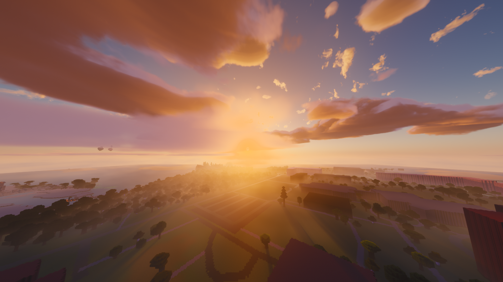

## An occasional richer afterglow

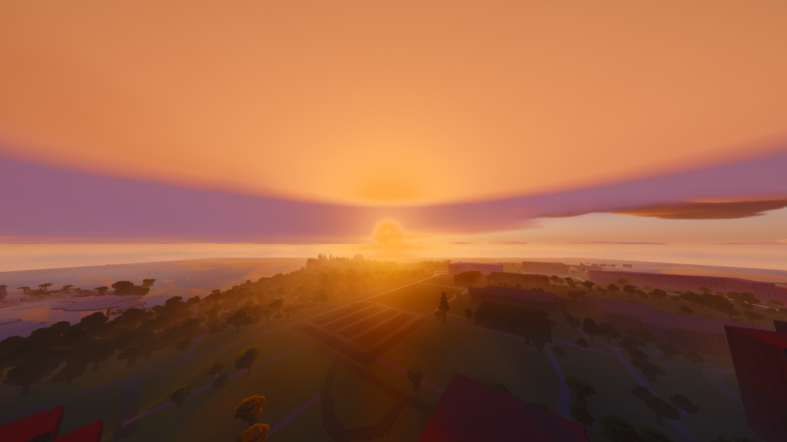

## Aurora over a snowy ridge

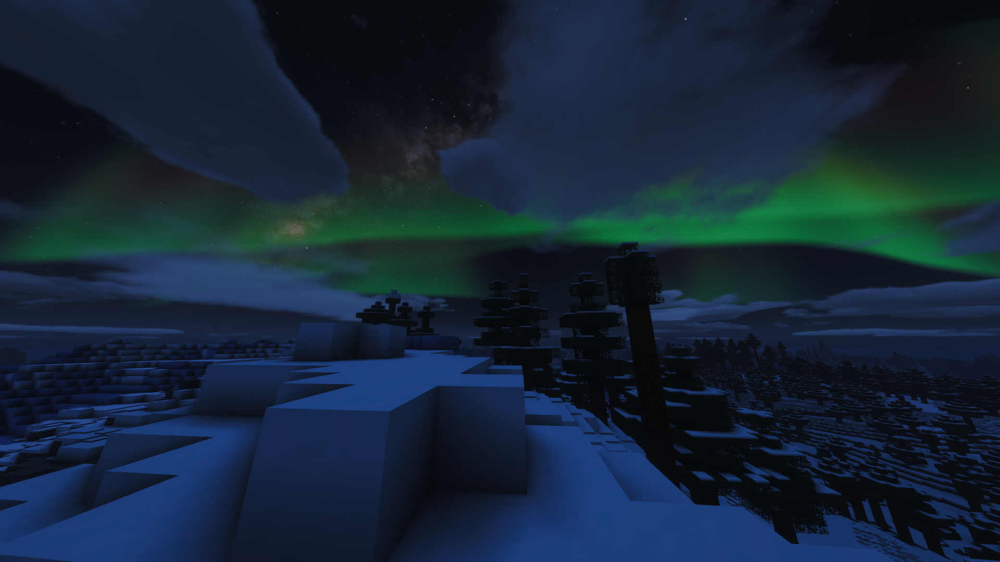

## Aurora from above the clouds

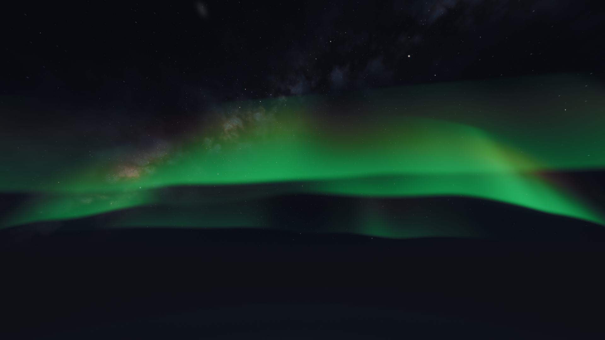

## Afternoon over a lush valley

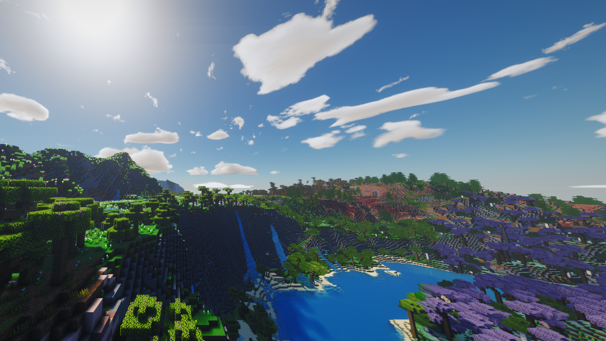

## Clouds on the water

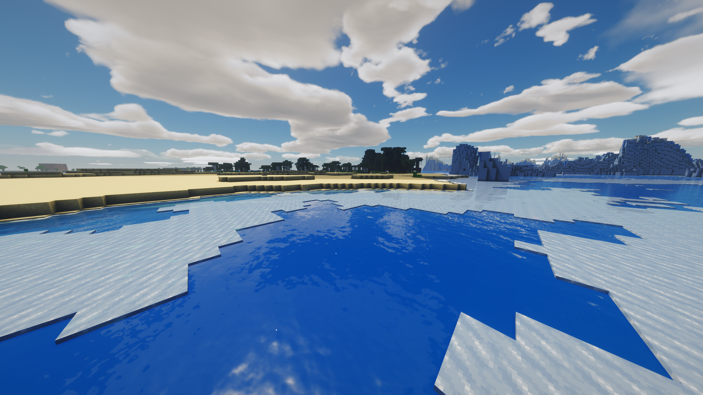

## Savanna coast

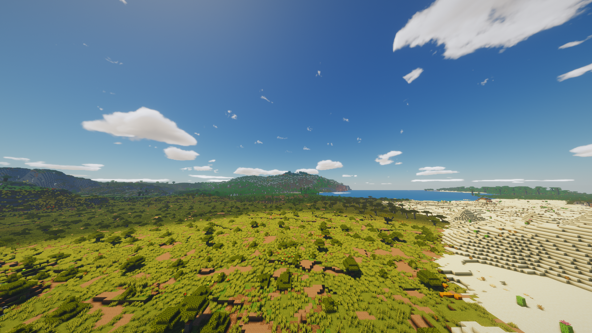

## Above the cloud layer

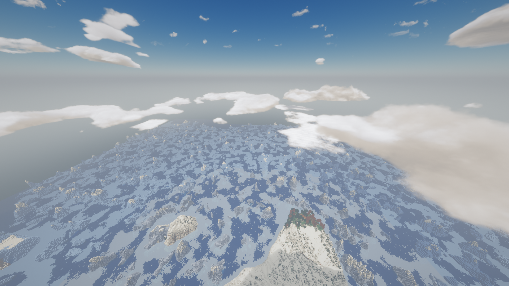

## Rain over the coast

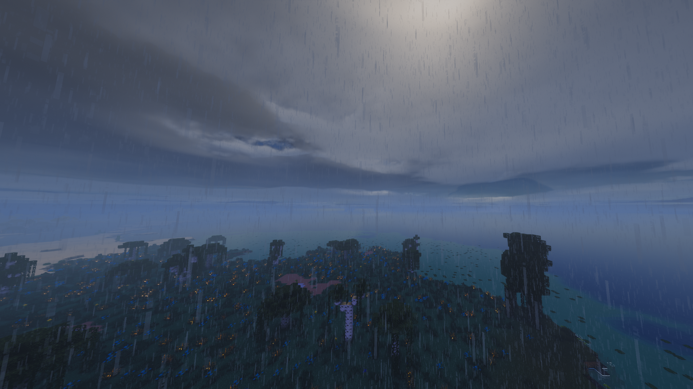

## Milky Way

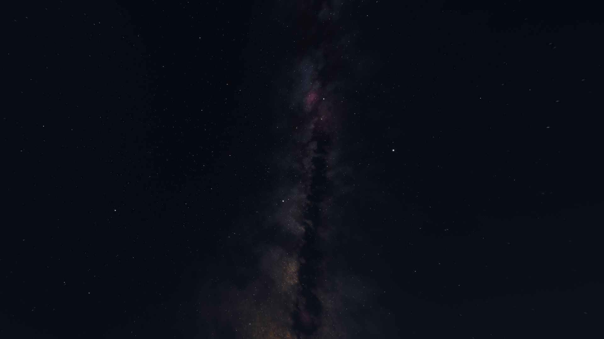

## Held torch on ice

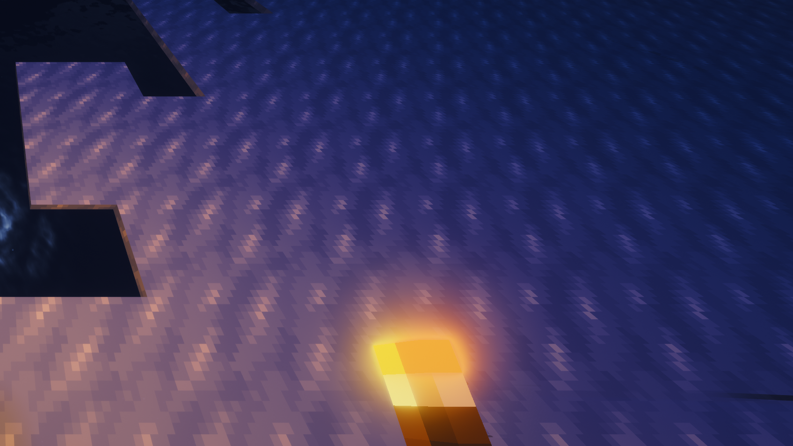

## Held soul torch on ice

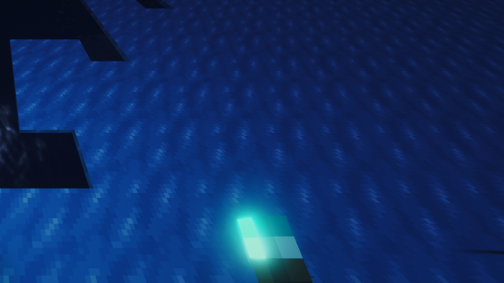
